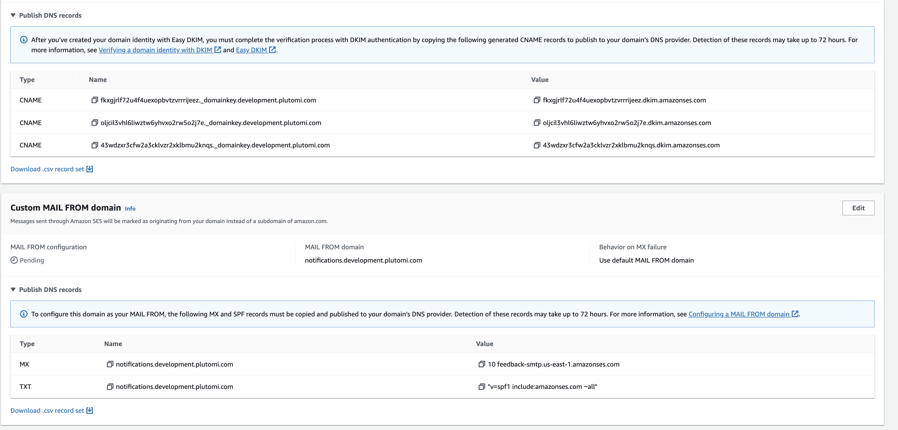

# Deploying

- [AWS (SES + SNS + SQS)](#aws)
- [Backend](#Kubernetes){#aws}

## AWS{#aws}

To deploy to AWS, make sure you have [configured SSO](https://docs.aws.amazon.com/cli/latest/userguide/cli-configure-sso.html) correctly. Update the `AWS_PROFILE` variable in [deploy.sh](deploy.sh) to match the profile names you want to use. Update the subdomain you want to use for sending emails in [configure-ses.ts](./services/aws/lib/configure-ses.ts).

Change directories into `/aws`, install dependencies with `npm i` and set up the environment variables in the `.env`. There is an `.env.example` file that you can copy to get started.

Once that's done, you can go back to the root and deploy using `./scripts/deploy.sh <development|staging|production>`.

After running the deploy script, most of your environment will be setup but you'll need to add a few records to your DNS provider. Your SES dashboard should look something like this with the records you need to add:



At the end of it you should have (for each environment)

3 DNS records for DKIM

> Key: XXXXXXXXXXXXX Value: XXXXXXXXXXXXX

1 MX Record for custom mail from

> Key: notifications.plutomi.com Value: feedback-smtp.us-east-1.amazonses.com Priority: 10

1 TXT Record for SPF

> Key notifications.plutomi.com "v=spf1 include:amazonses.com ~all"

1 TXT Record for DMARC.
This is a TXT record with the name `_dmarc.yourMAILFROMdomain.com` and value `v=DMARC1; p=none; rua=mailto:you@adomainwhereyoucanreceiveemails.com`
See [this link](https://docs.aws.amazon.com/ses/latest/dg/send-email-authentication-dmarc.html) for more information.

Then after all of that is done, make sure to beg aws to get you out of sandbox since you now have a way to handle complaints.

## Rest of the App{#backend}

Plutomi runs on Kubernetes, specifically [K3S](https://k3s.io). The web and API are both dockerized and the images can be found on [Docker Hub](https://hub.docker.com/u/plutomi). We will do our best to keep **x86** and **ARM** versions up to date but x86 will take priority this is the only architecture we have available in the US at this time.

For the datastores, we use [MongoDB](https://mongodb.com/) and [NATS](https://nats.io/). We use the official [MongoDB docker image](https://hub.docker.com/_/mongo/tags?page=&page_size=&ordering=&name=7.0.8) with our own StatefulSet and are debating doing the same thing for NATS soon, although they recommend installing the [Helm chart directly](https://docs.nats.io/running-a-nats-service/nats-kubernetes). We have _not_ explored using alternative MongoDB Helm charts but are considering it, like those from Bitnami or Percona.

Plutomi has _not_ been tested to run on a VPS with networked storage like EC2, although this shouldn't be a blocker as K3S can and does work with it. We run on multiple nodes with local SSD storage on Hetzner. If you'd like some free credits to get started with Hetzner, please use [our referral link](https://hetzner.cloud/?ref=7BufEUOAUm8x).

### Prerequisites

- 3 nodes with Ubuntu 20.04 installed and SSH access

- Install SealedSecrets locally on your machine

```bash
brew install kubeseal
```

This is how we encrypt secrets in the cluster AND allows us to commit them into this repository. You can find more information on how to use it [here](https://sealed-secrets.netlify.app/).

- Open these ports on each of the nodes so they can talk back and forth to each other:

  - 2379-2380 - Required for high availability etcd
  - 6443 - K3S Supervisor and for the API server
  - 10250 - Kubelet metrics
  - 8080 - [Kubeseal port](https://github.com/bitnami-labs/sealed-secrets/issues/1447#issuecomment-2022217031)

  - 30000-32767 - NodePort Services
  - 8472 - Required for Flannel VXLAN

- Open these ports INBOUND on the nodes so that the internet can talk to the cluster:

  - 80 - HTTP - Required if using cert-manager / LetsEncrypt for HTTPS
  - 443 - HTTPS

> If installing on a single node, you can simple do:

    *`curl -sfL https://get.k3s.io | sh -`*

and skip most of the steps below.

##### 1. Initialize the first node

- Create a K3S_TOKEN secret

```bash
openssl rand -base64 50 | tr -d '\n/=+'
```

- Install K3S with that token

```bash
curl -sfL https://get.k3s.io | K3S_TOKEN=TOKEN_YOU_GENERATED K3S_KUBECONFIG_MODE="644" K3S_NODE_NAME=YOUR_APP-production-0 sh -s - server  --cluster-init  --node-ip PRIVATE_NETWORKING_PORT --advertise-address PRIVATE_NETWORKING_PORT --node-external-ip PUBLIC_IP --tls-san PRIVATE_NETWORKING_PORT --tls-san PUBLIC_IP
```

>

- Copy the new secret token that was created

```bash
cat /var/lib/rancher/k3s/server/node-token
```

- Install the K3S agent on the second node

```bash
curl -sfL https://get.k3s.io | K3S_TOKEN=TOKEN_EXTRACTED_FROM_NODE_1 K3S_KUBECONFIG_MODE="644" K3S_NODE_NAME=YOUR_APP-production-1 sh -s - server  --server https://PRIVATE_IP_OF_NODE_1:6443 K3S_KUBECONFIG_MODE="644"   --node-ip PRIVATE_IP_OF_THE_SECOND_NODE--advertise-address PRIVATE_IP_OF_THE_SECOND_NODE--node-external-ip PUBLIC_IP_OF_THE_SECOND_NODE --tls-san PRIVATE_IP_OF_THE_SECOND_NODE --tls-san PUBLIC_IP_OF_THE_SECOND_NODE
```

...and repeat the process for the third node.

Veriy all the nodes are connected:

```bash
sudo k3s kubectl get nodes
```

Then, label each node for pod spreading. Run this command, and change the label for each node:

```bash
kubectl label nodes plutomi-production-0 plutomi-role=plutomi-production-0
```

Now confirm we are using the correct KUBECCONFIG in one of the nodes:

```bash
export KUBECONFIG=/etc/rancher/k3s/k3s.yaml
```

- Install Helm

```bash
curl https://raw.githubusercontent.com/helm/helm/main/scripts/get-helm-3 | bash
```

- Install Sealed Secrets

```bash
helm repo add sealed-secrets https://bitnami-labs.github.io/sealed-secrets

helm install sealed-secrets -n kube-system --set-string fullnameOverride=sealed-secrets-controller sealed-secrets/sealed-secrets
```

- Install cert-manager for the TLS certificate

```bash
helm repo add jetstack https://charts.jetstack.io
```

```bash
helm repo update
```

This one will take a minute:

```bash
helm install \
 cert-manager jetstack/cert-manager \
  --namespace cert-manager \
  --create-namespace \
  --set installCRDs=true
```
