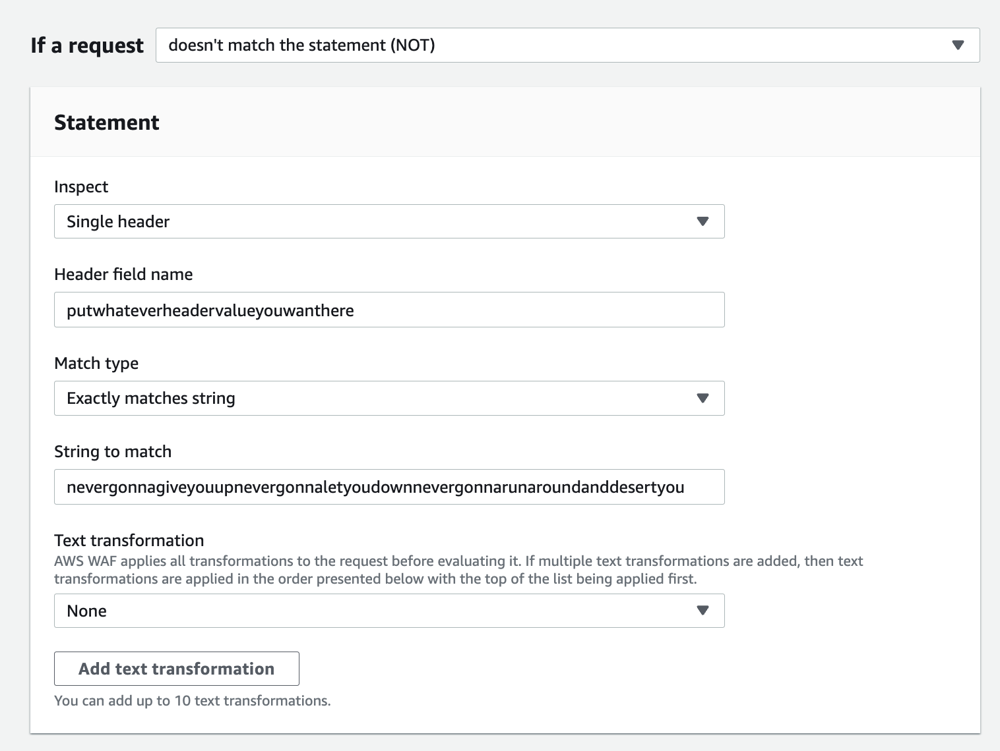
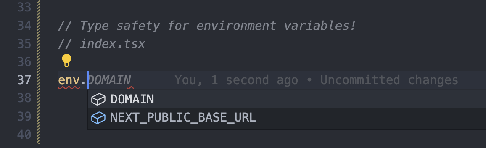

> :warning: **This repository is currently undergoing maintenance and many breaking changes. These changes are necessary to enhance the long term stability of the project. Use at your own risk as long as this banner is here - things _will_ be broken!**

---

# Plutomi


[](http://makeapullrequest.com)
[](https://www.tldrlegal.com/license/apache-license-2-0-apache-2-0)
[](#contributors)

Plutomi is a _multi-tenant_ [applicant tracking system](https://en.wikipedia.org/wiki/Applicant_tracking_system) that streamlines your entire application process with automated workflows at any scale.


## Motivation

Having worked at a company that needed to recruit thousands of contractors every month, improving our acquisition flow at that scale became a challenge. Many processes had to be done manually because there just wasn't an API available for it. We often hit limits and had to work around them with a myriad of webhooks, queues, and batch jobs to keep things running smoothly. It would have benefited us to have an open platform to contribute to and build upon and this project is [my](https://www.linkedin.com/in/joswayski/) attempt to do just that.

## Summary

You can create `applications` which people can apply to. An application can be anything from a job, a location for a delivery company, or a program like a summer camp.

In these applications, you can create `stages` which are individual steps that need to be completed by your `applicants`. You can add `questions` and setup automatic move `rules` that determine where applicants go next depending on their `responses` or after a certain time period.

An application for a delivery company might look like this:

**New York City**

Stages:

1. **Questionnaire** - Collect basic information of an applicant. If an applicant does not complete this stage in 30 days, move them to the _Waiting List_.
2. **Waiting List** - An idle pool of applicants
3. **Document Upload** - Collect an applicant's license
4. **Final Review** - Manually review an applicant's license for compliance
5. **Ready to Drive** - Applicants that have completed your application

## Prerequisites

- [Node 18](https://nodejs.org/en/download)
- [Docker](https://docs.docker.com/get-docker/)
- Install the [AWS CDK CLI](https://docs.aws.amazon.com/cdk/v2/guide/getting_started.html#getting_started_install) `yarn global add aws-cdk`
- Create a [Hosted Zone](https://docs.aws.amazon.com/Route53/latest/DeveloperGuide/CreatingHostedZone.html) in Route53 with your domain
  - If creating a `staging` or `development` environment, you can use a subdomain like `staging.yourdomain.com`. In your `prod` environment, the hosted zone should be for your base domain like `yourdomain.com`, and you should add the name servers from your `staging` or `development` hosted zones to your `production` hosted zone.
  - Our CDK stack will create the necessary DNS records for the SSL certificate (using ACM) and the necessary records to send emails using SES. We recommend creating an email alias at `staging.yourdomain.com` & `development.yourdomain`, and adding the MX records to the proper hosted zones.

## Useful Commands

- `yarn` - Install deps.
  - We are using a Monorepo so shared deps will be at the `root` while workspace specific deps will be installed in the appropriate workspace. Yarn workspaces paired with [nx](https://nx.dev/) is a killer combo
- `yarn build` - Build the app, the correct ordering is set in the `nx.json` file for dependencies across packages like shared types

- `yarn dev` - Start the app

- `yarn pretty` & `yarn pretty:fix` - Run prettier & fix any issues

- `yarn lint` & `yarn lint:fix` - Run the linter & fix any issues

- `yarn tidy` - Runs `pretty:fix` and `lint:fix` sequentially
<!-- cspell:disable-next-line -->
- `yarn spellcheck` - Mkae srue you didn't goof up a wrod

- `yarn aws:login` - Login to AWS with your credentials using SSO

  - To setup AWS with SSO, you can check [this tutorial](https://docs.sst.dev/setting-up-aws#create-a-management-account)

- `yarn deploy:dev/stage/prod` - Deploy to the specified environment

## Language, Tooling, & Infrastructure

> Make sure to open the `plutomi.code-workspace` file to get the best dev experience with linters and such

Typescript all the things. Infrastructure is managed by CDK aside from the DB and WAF. The frontend is [NextJS](https://nextjs.org/) and we have an [Express](https://expressjs.com/) app serving it from [AWS Fargate](https://aws.amazon.com/fargate/).

#### WAF

There isn't good support for [official L2 constructs for AWS WAF](https://docs.aws.amazon.com/cdk/api/v2/docs/aws-cdk-lib.aws_waf-readme.html) yet, so we set this up manually in the console. There are two main rules which you should apply:

1. Block all requests that do not have a valid `CF_HEADER_KEY` header & value



- This will block all requests that hit the load balancer directly and force going through CloudFront

2. IP Rate limiting for `/api/` endpoints

- This is self explanatory, we don't want to get DDOS'd

#### MongoDB

We are using Mongo on [Atlas](https://www.mongodb.com/atlas/database) due to DynamoDB no longer meeting our needs. We store everything in one collection ([yes, really](https://youtu.be/eEENrNKxCdw?t=960)). It works great. No ORM as they aren't really designed for the way we are using it and it was hard trying to shoehorn this pattern in. This may change in the future.

#### Environment Variables

> Check the .env.sample in each package for guidance

In **packages/env**, there is an `env.ts` file which has **ALL** of the environment variables for the app as well as the schema for each package. We `pick` the environment variables needed in each package to create a schema:

```typescript
export const allEnvVariablesSchema = z.object({
  PORT: portSchema,
  NODE_ENV: z.nativeEnum(NodeEnvironment),
  NEXT_PUBLIC_DEPLOYMENT_ENVIRONMENT: z.nativeEnum(DeploymentEnvironment),
  DOMAIN: z.string(),
  NEXT_PUBLIC_BASE_URL: z.string().url()
});

export const webEnvSchema = allEnvVariablesSchema.pick({
  NEXT_PUBLIC_BASE_URL: true,
  DOMAIN: true
});

export const apiEnvSchema = allEnvVariablesSchema.pick({
  PORT: true,
  NODE_ENV: true,
  NEXT_PUBLIC_BASE_URL: true
});
```

When _running locally_ , the `.env` in the `api` package is the most important. Those are the variables that are used throughout the app. When _deploying_ locally (not recommended), things change a bit and the `web` package (NextJS) uses its own local `.env` and the API uses the `.env` in the `infra` package.

To setup an `env.ts` file in each package, you can use the `parseEnv` function:

```typescript
import { webEnvSchema, parseEnv, SchemaEnvironment } from "@plutomi/env";

export const env = parseEnv({
  envSchema: webEnvSchema,
  // Used for error logging which environment has invalid variables
  schemaEnvironment: SchemaEnvironment.WEB
});
```

You can then get type safe environment variables in each package:



## License

This project is licensed under the [Apache 2.0 license](LICENSE). Here is a [TLDR](https://www.tldrlegal.com/license/apache-license-2-0-apache-2-0).

## Contributing & Contributors

To make a contribution, submit a pull request into the `main` branch. You will be asked to sign a [Contributor License Agreement](https://en.wikipedia.org/wiki/Contributor_License_Agreement) for your PR. You'll only have to do this once.

Thanks goes to these wonderful people who contributed!

<!-- ALL-CONTRIBUTORS-LIST:START - Do not remove or modify this section -->
<!-- prettier-ignore-start -->
<!-- markdownlint-disable -->
<table>
  <tr>
    <td align="center"><a href="https://github.com/joswayski"><br /><sub><b>Jose Valerio</b></sub></a><br /><a href="https://github.com/plutomi/plutomi/commits?author=joswayski" title="Code">💻</a> <a href="#infra-joswayski" title="Infrastructure (Hosting, Build-Tools, etc)">🚇</a> <a href="#maintenance-joswayski" title="Maintenance">🚧</a></td>
    <td align="center"><a href="https://github.com/praguru14"><br /><sub><b>praguru14</b></sub></a><br /><a href="https://github.com/plutomi/plutomi/commits?author=praguru14" title="Code">💻</a> <a href="#maintenance-praguru14" title="Maintenance">🚧</a></td>
    <td align="center"><a href="https://github.com/mazupicua"><br /><sub><b>Jose Valerio</b></sub></a><br /><a href="https://github.com/plutomi/plutomi/commits?author=mazupicua" title="Code">💻</a> <a href="#maintenance-mazupicua" title="Maintenance">🚧</a> <a href="https://github.com/plutomi/plutomi/issues?q=author%3Amazupicua" title="Bug reports">🐛</a></td>
    <td align="center"><a href="https://github.com/Jeremyjay121"><br /><sub><b>Jeremy Trenchard</b></sub></a><br /><a href="https://github.com/plutomi/plutomi/commits?author=Jeremyjay121" title="Code">💻</a></td>
  </tr>
</table>

<!-- markdownlint-restore -->
<!-- prettier-ignore-end -->

<!-- ALL-CONTRIBUTORS-LIST:END -->

This project follows the [all-contributors](https://github.com/all-contributors/all-contributors) specification. Contributions of any kind welcome!

<a name="questions"></a>

## Questions

Open an issue! Or [DM me on Twitter](https://twitter.com/notjoswayski) or email jose@plutomi.com
