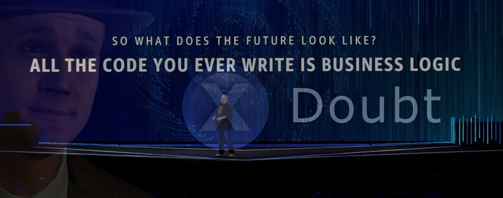

# Plutomi

### [Website / Live Demo](https://plutomi.com)

Plutomi is an [applicant tracking system](https://en.wikipedia.org/wiki/Applicant_tracking_system) that streamlines your entire application process with automated workflows at any scale.

## Motivation

Having worked at a company that needed to recruit thousands of contractors every month, improving our acquisition flow at that scale became a challenge. Many processes had to be done manually because there just wasn't an API available for it. We often hit limits and had to work around them with a myriad of webhooks, queues, and batch jobs to keep things running smoothly. It would have benefited us to have an open platform to contribute to and build upon and this project is our attempt to do just that.

## Summary

In your recruiting flow you can create `openings` which people can apply to. An opening can be anything from a job, a location for a delivery company, or a program like a summer camp.

In these openings, you can create `stages` which are individual steps for your application. You can add questions for applicants to answer, and setup automatic move rules that determine where applicants go next depending on their answers or after a certain time period.

An _opening_ for a delivery company might look like this:

Opening name: **New York City**

Stage order:

1. **Questionnaire** - Collect basic information of an applicant. If an applicant does not complete this stage in 30 days, move them to the _Waiting List_.
2. **Waiting List** - An idle pool of applicants
3. **Document Upload** - Collect an applicant's license
4. **Final Review** - Manually review an applicant's license for compliance
5. **Ready to Drive** - Applicants that have completed your application

## Prerequisites

- Install [Docker](https://docs.docker.com/get-docker/)
- Create `.env.development` & `.env.production` files, see `.env.sample` for the values required
- Create a [Hosted Zone](https://docs.aws.amazon.com/Route53/latest/DeveloperGuide/CreatingHostedZone.html) in Route53 with your domain
- Create a [verified identity](https://docs.aws.amazon.com/ses/latest/DeveloperGuide/verify-domain-procedure.html) with your domain in SES
- Create a [certificate for your domain](https://docs.aws.amazon.com/acm/latest/userguide/gs-acm-request-public.html#request-public-console) in AWS Certificate Manager

> :point_up: Will try to add the Route53 / ACM / SES setup to CDK eventually [#390](https://github.com/plutomi/plutomi/issues/390)

## Useful commands

| Command                                                                                                 | Function                                                                                                                                           |
| ------------------------------------------------------------------------------------------------------- | -------------------------------------------------------------------------------------------------------------------------------------------------- |
| npm run dev                                                                                             | Will deploy a copy of **most** the backend to AWS (Dynamo, Event Bridge, SQS, Step Functions, etc). The frontend & Express server run in localhost |
| npm run test                                                                                            | Will run tests                                                                                                                                     |
| npm run deploy-prod                                                                                     | Will deploy everything to your production environment                                                                                              |
| npx cross-env NODE_ENV=(development or production) cdk deploy -e (development or production)-STACK_NAME | Will deploy a specific stack in the desired environment                                                                                            |

## Language, Tooling, & Infrastructure

All infrastructure is managed by CDK and we use [Jest](https://jestjs.io/) for testing. Everything is written TypeScript and we would appreciate any assistance on types or tests as we're definitely not the best :sweat_smile:

The frontend uses the [Serverless-Nextjs](https://serverless-nextjs.com/docs/cdkconstruct/) CDK construct. The API is your typical Express app running on Fargate. We would like to migrate this to a full serverless setup with API Gateway + Lambda but, _at this time_, we feel Fargate has more advantages (mostly around developer experience & third party libraries) without many of the downsides...

When deleting an entity that has child items such as an org and its openings or an opening and its stages, the parent is deleted right away but the children will be deleted asynchronously with a state machine. [At the top of the workflow](images/DeleteChildrenStepFunction.png) there is a `choice` state which figures out which entity was deleted. It then retrieves all of the **_top-level_** child items for that entity (deleting an opening only retrieves the stages, but not the applicants in those stages). The state machine maps through each item and deletes them. This causes the state machine to be called again: Dynamo stream -> EventBridge -> StepFunction with the newly deleted entity. It's a cascading flow of deletions.

There is [another state machine](images/CommsStepFunction.png) for sending emails that triggers on certain events such as a new `LOGIN_EVENT` or a `LOGIN_LINK` request.

## DynamoDB

We're using a single table design for this project. If you're new to DynamoDB, I created [a playlist](https://youtube.com/playlist?list=PL4wKJluo18Z2Nh1QlU0LXKy6EbPwB17xq) that will help you get accustomed to it. There are videos from Alex Debrie, Rick Houlihan, Pete Naylor, and an awesome talk by Kai Zhao on adaptive capacity.

To play around with the data model locally, you can download [NoSQL Workbench](https://docs.aws.amazon.com/amazondynamodb/latest/developerguide/workbench.settingup.html) and import the [NoSQLWorkbench.json](schema/NoSQLWorkbench.json) file into it. You can even export the table to your AWS account directly.

We're also using Athena to query Dynamo with plain old SQL using [Federated Queries](https://docs.aws.amazon.com/athena/latest/ug/connect-to-a-data-source.html) - ([video](https://www.youtube.com/watch?v=tZia_5qxPkY)). We haven't figured out how to add a data source using CDK but this is very simple. Once deployed, click [Connect Data Source](https://console.aws.amazon.com/athena/home?region=us-east-1#/data-sources) and select **DynamoDB**. Choose a name and then select the lambda function that is created in the stack: _NODE_ENV_-athena-dynamo-query-function

## Other useful repos:

- [Serverless Nextjs](https://github.com/serverless-nextjs/serverless-next.js)
- [AWS ECS Patterns](https://github.com/aws/aws-cdk/tree/master/packages/%40aws-cdk/aws-ecs-patterns)
- [Serverless CDK Patterns](https://github.com/cdk-patterns/serverless)

## Contributing

To make a contribution, submit a pull request into the `main` branch. You will be asked to sign a [Contributor License Agreement](https://en.wikipedia.org/wiki/Contributor_License_Agreement) for your PR. You'll only have to do this once.

This project tries to follow Semantic Pull Requests some what.
Your PR _title_ should have the following format:

| Type                  | Description                                                          |
| --------------------- | -------------------------------------------------------------------- |
| feat: OR enhancement: | Added a new feature or enhancement                                   |
| fix:                  | Squashed some bugs!                                                  |
| docs:                 | Updated documentation, readme, examples                              |
| test:                 | Added / modified tests                                               |
| chore:                | Maintenance, refactoring, etc. If it doesn't fit above, it goes here |

Example: _fix: Removed the double modals popping up on login_

## License

This project is licensed under the [Apache 2.0 license](LICENSE)

## Contributors ✨

Thanks goes to these wonderful people ([emoji key](https://allcontributors.org/docs/en/emoji-key)):

<!-- ALL-CONTRIBUTORS-LIST:START - Do not remove or modify this section -->
<!-- prettier-ignore-start -->
<!-- markdownlint-disable -->
<table>
  <tr>
    <td align="center"><a href="https://github.com/joswayski"> <b>Jose Valerio</b></a> <a href="https://github.com/plutomi/plutomi/commits?author=joswayski" title="Code">💻</a> <a href="#infra-joswayski" title="Infrastructure (Hosting, Build-Tools, etc)">🚇</a> <a href="#maintenance-joswayski" title="Maintenance">🚧</a></td>
    <td align="center"><a href="https://github.com/praguru14"> <b>praguru14</b></a> <a href="https://github.com/plutomi/plutomi/commits?author=praguru14" title="Code">💻</a> <a href="#maintenance-praguru14" title="Maintenance">🚧</a></td>
    <td align="center"><a href="https://github.com/mazupicua"> <b>Jose Valerio</b></a> <a href="https://github.com/plutomi/plutomi/commits?author=mazupicua" title="Code">💻</a> <a href="#maintenance-mazupicua" title="Maintenance">🚧</a> <a href="https://github.com/plutomi/plutomi/issues?q=author%3Amazupicua" title="Bug reports">🐛</a></td>
  </tr>
</table>

<!-- markdownlint-restore -->
<!-- prettier-ignore-end -->

<!-- ALL-CONTRIBUTORS-LIST:END -->

This project follows the [all-contributors](https://github.com/all-contributors/all-contributors) specification. Contributions of any kind welcome!
