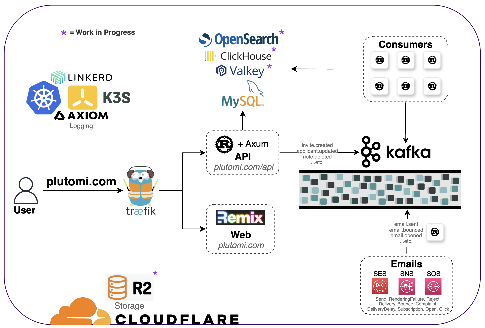

# Plutomi

> ⚠️ _WARNING_ ⚠️
>
> _This project is **NOT** production ready and can change at any time. You **WILL** lose your data_ :)

### [Website / Live Demo](https://plutomi.com)

Plutomi is an [applicant tracking system](https://en.wikipedia.org/wiki/Applicant_tracking_system).

You can create `openings`, which people can apply to. An opening can be anything from a job, a location for a delivery company, or a program like a summer camp.

In these openings, you can create `stages` which are individual steps for your application. You can add questions which applicants can answer, and setup automatic move rules that determine where applicants go next depending on their answers or after a certain time period.

An _opening_ for a delivery company might look like this:

Opening name: **New York City**

Stage order:

1. **Questionnaire** - Collect basic information of an applicant. If an applicant does not complete this stage in 30 days, move them to the _Waiting List_.
2. **Waiting List** - An idle pool of applicants
3. **Document Upload** - Collect an applicant's license
4. **Final Review** - Manually review an applicant's license for compliance
5. **Ready to Drive** - Applicants that have completed your application

## Motivation

## Prerequisites

- Install [Docker](https://docs.docker.com/get-docker/)
- Create a [Hosted Zone](https://docs.aws.amazon.com/Route53/latest/DeveloperGuide/CreatingHostedZone.html) in Route53 with your domain
- Create a [verified identity](https://docs.aws.amazon.com/ses/latest/DeveloperGuide/verify-domain-procedure.html) with your domain in SES
- Create a [certificate for your domain](https://docs.aws.amazon.com/acm/latest/userguide/gs-acm-request-public.html#request-public-console) in AWS Certificate Manager

> :point_up: Will try to add the Route53 / ACM / SES setup to CDK eventually  [#390](https://github.com/plutomi/plutomi/issues/390)

## Useful commands

- `npm run dev` run the app locally
- `npm run deploy` deploy the site - _Docker image is built and deployed by CDK automatically!_
- `npm run destroy` destroy the site
- `cdk diff` compare deployed stack with current state
- `cdk synth` emits the synthesized CloudFormation template

## Language & Tooling

The project is 100% TypeScript. Would appreciate any assistance on types as we're definitely not the best :sweat_smile:

We believe CDK to be the future and it's nice to have 'first-class' tooling directly from AWS. Therefore,
**all architecture is managed by CDK**.

We use Docker to containerize our Nextjs app to be run on AWS Fargate.

## Architecture

We will eventually move the front end to [Serverless-Nextjs](https://github.com/serverless-Nextjs/serverless-next.js) and lambda for background tasks such as queues, DynamoDB streams, email sending, etc. just not for the main API of the site. That is being migrated to an Express server at the moment.

## DynamoDB Schema

> Schema is subject to change but I will try to keep this updated as much as I can

We're using a single table design for this project. If you're new to Dynamo, I recommend watching these talks by Alex DeBrie and Rick Houlihan first.

Here are a few:

- Alex DeBrie @ re:Invent 2020 - [Data modeling with Amazon DynamoDB – Part 1](https://www.youtube.com/watch?v=fiP2e-g-r4g)
- Alex DeBrie @ re:Invent 2020 -[ Data modeling with Amazon DynamoDB – Part 2](https://www.youtube.com/watch?v=0uLF1tjI_BI)

- Rick Houlihan @ re:invent 2018 - [Advanced Design Patterns for DynamoDB (DAT401)](https://www.youtube.com/watch?v=HaEPXoXVf2k)
- Rick Houlihan @ re:invent 2019 - [Advanced design patterns for DynamoDB (DAT403-R1)](https://www.youtube.com/watch?v=6yqfmXiZTlM)

Also, don't forget to buy **THE** [DynamoDB Book](https://www.dynamodbbook.com/) by Alex ;)

To create & edit your data models locally, I suggest downloading [NoSQL Workbench](https://docs.aws.amazon.com/amazondynamodb/latest/developerguide/workbench.settingup.html). The files [CloudFormation.json](Schema/CloudFormation.json) and [NoSQLWorkbench.json](Schema/NoSQLWorkbench.json) are direct outputs from it that have the current schema. The Workbench tool also allows you to easily visualize your schema, export the table to your AWS account, and even generate queries in Python, JavaScript, or Java.

I've created a handy spreadsheet with access patterns and use cases, you can [view it here](https://docs.google.com/spreadsheets/d/1KZMJt0X2J0s1v8_jz6JC7aiiwYW8qVV9pKWobQ5012Y/edit?usp=sharing). It helps to follow along with NoSQL Workbench on your own machine or you can view the pictures next to this README.

You might have noticed that _some_ sort keys (SK, GSI1SK, GSI2SK) have the `entity type` prefixed (e.g. `ORG_ROLE`). This is intentional and it's so we can retrieve these sub-entities when doing a query on the parent.
For example, when retrieving an `org`, we might want to get all of the `roles` for that org as well. We can do one query with `PK = orgId and SK = begins_with(ORG)` :)

Some partitions will [need to be sharded](https://youtu.be/_KNrRdWD25M?t=581) in the future, specially for high throughput items at millions of items scale (get all applicants in an org, in a stage, in an opening, all webhook history, etc.). Not going to bother with that for now but it _is_ on my radar!

Also another thing to note, items that can be _rearranged_ such as stages, stage questions, stage rules, etc. have a limit on how many of these items can be created. Since we have to store the itemId in the parent to preserve the order, we have to make sure we don't go over Dynamo's 400kb limit on the parent. This shouldn't be an issue as if you have more than (whatever the default is at the time) questions per stage, or stages per opening, something is.. seriously wrong. It is a soft limit, but it's so things can stay performant.

And other useful repos:

- [AWS ECS Patterns](https://github.com/aws/aws-cdk/tree/master/packages/%40aws-cdk/aws-ecs-patterns)
- [Serverless CDK Patterns](https://github.com/cdk-patterns/serverless)

## Common errors

> Argument of type 'this' is not assignable to parameter of type 'Construct'

Make sure all of your `@aws-cdk/*` dependencies are running the same version + make sure whatever you are using in the construct is actually being imported at the top of the file

> ERROR [internal] load metadata for public.ecr.aws/sam/build-nodejs

Try running this command: `aws ecr-public get-login-password --region us-east-1 | docker login --username AWS --password-stdin public.ecr.aws/sam/build-nodejs`

## Contributing

To make a contribution, submit a pull request into the `main` branch. You will be asked to sign a [Contributor License Agreement](https://en.wikipedia.org/wiki/Contributor_License_Agreement) for your PR. You'll only have to do this once.

This project tries to follow Semantic Pull Requests some what.
Your PR _title_ should have the format `:emoji: type:` whatever-you-worked-on.

| Type                             | Description                                                                                    |
| -------------------------------- | ---------------------------------------------------------------------------------------------- |
| :sparkles: feat: OR enhancement: | Added a new feature or enhancement                                                             |
| :bug: fix:                       | Squashed some bugs!                                                                            |
| :book: docs:                     | Updated documentation, readme, examples                                                        |
| :rotating_light: test:           | Added / modified tests                                                                         |
| :broom: chore:                   | Maintenance, cleanup, comment removal, refactoring, etc. If it doesn't fit above, it goes here |

Example: _:bug: fix: Removed the double modals popping up on login_

## License

This project is licensed under the `GNU AGPLv3` license. It can be viewed [here](https://choosealicense.com/licenses/agpl-3.0/) or in the [LICENSE.md](LICENSE.md) file.

---

For any questions, please submit an issue or email contact@plutomi.com!

## Contributors ✨

Thanks goes to these wonderful people ([emoji key](https://allcontributors.org/docs/en/emoji-key)):

<!-- ALL-CONTRIBUTORS-LIST:START - Do not remove or modify this section -->
<!-- prettier-ignore-start -->
<!-- markdownlint-disable -->
<table>
  <tr>
    <td align="center"><a href="https://github.com/joswayski"> <b>Jose Valerio</b></a> <a href="https://github.com/plutomi/plutomi/commits?author=joswayski" title="Code">💻</a> <a href="#infra-joswayski" title="Infrastructure (Hosting, Build-Tools, etc)">🚇</a> <a href="#maintenance-joswayski" title="Maintenance">🚧</a></td>
    <td align="center"><a href="https://github.com/praguru14"> <b>praguru14</b></a> <a href="https://github.com/plutomi/plutomi/commits?author=praguru14" title="Code">💻</a> <a href="#maintenance-praguru14" title="Maintenance">🚧</a></td>
    <td align="center"><a href="https://github.com/mazupicua"> <b>Jose Valerio</b></a> <a href="https://github.com/plutomi/plutomi/commits?author=mazupicua" title="Code">💻</a> <a href="#maintenance-mazupicua" title="Maintenance">🚧</a> <a href="https://github.com/plutomi/plutomi/issues?q=author%3Amazupicua" title="Bug reports">🐛</a></td>
  </tr>
</table>

<!-- markdownlint-restore -->
<!-- prettier-ignore-end -->

<!-- ALL-CONTRIBUTORS-LIST:END -->

This project follows the [all-contributors](https://github.com/all-contributors/all-contributors) specification. Contributions of any kind welcome!
