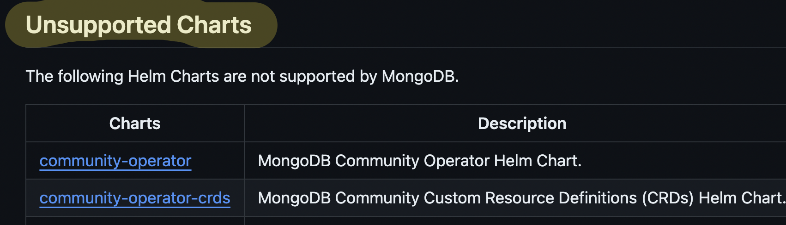

### Why aren't you using the MongoDB Operator?

Enterprise requires a license, we're already trying to reduce costs. Community operator is not as feature rich as the enterprise version. We're not using any of the features that the operator provides, so it's not worth the cost. It doesn't even come with backups :$

Also, [this comment](https://www.reddit.com/r/kubernetes/comments/nu6c82/comment/h0wa88r/?utm_source=share&utm_medium=web3x&utm_name=web3xcss&utm_term=1&utm_content=share_button) put me off a bit.

It was also a.. fun.. experience setting it up from scratch in a StatefulSet. Fun fun.
